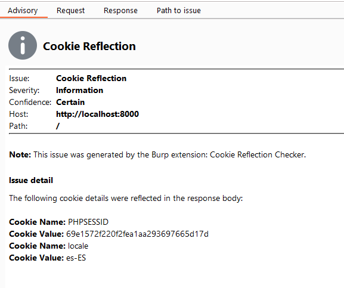
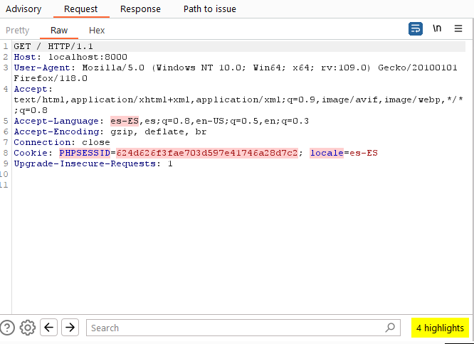

# Cookie Reflection
A Burp Suite extension which displays those cookies being reflected in the response body.

Passive scanner check which analyses the `Cookie:` header being sent onto each request, parses and URL decodes every cookie from it and checks on the response body of that request to see if any of the cookie names or values are present.
Moreover, this extension will also highlight the positions at which it's finding a reflected cookie, both in the Request and the Response tab.

Issues are raised as **Informational** as they do not demonstrate a specific security issue.
Nevertheless they can assist to find vulnerabilities for [Web Cache Poisoning](https://portswigger.net/web-security/web-cache-poisoning) or Web Cache Deception.

## Installation

`BurpSuite -> Extensions -> Add -> Extension Type: Python -> Select file: cookiereflection.py -> Next till Finish`

## Screenshots

*Issue Raised by the Extension, displaying every cookie affected*

*Highlighting being done by the extension to show where each cookie reflected is present*

## References

*[https://book.hacktricks.xyz/pentesting-web/cache-deception](https://book.hacktricks.xyz/pentesting-web/cache-deception)*

*[https://portswigger.net/web-security/web-cache-poisoning](https://portswigger.net/web-security/web-cache-poisoning)*

*[Cache Deception Allows Account Takeover](https://hackerone.com/reports/1698316)*
